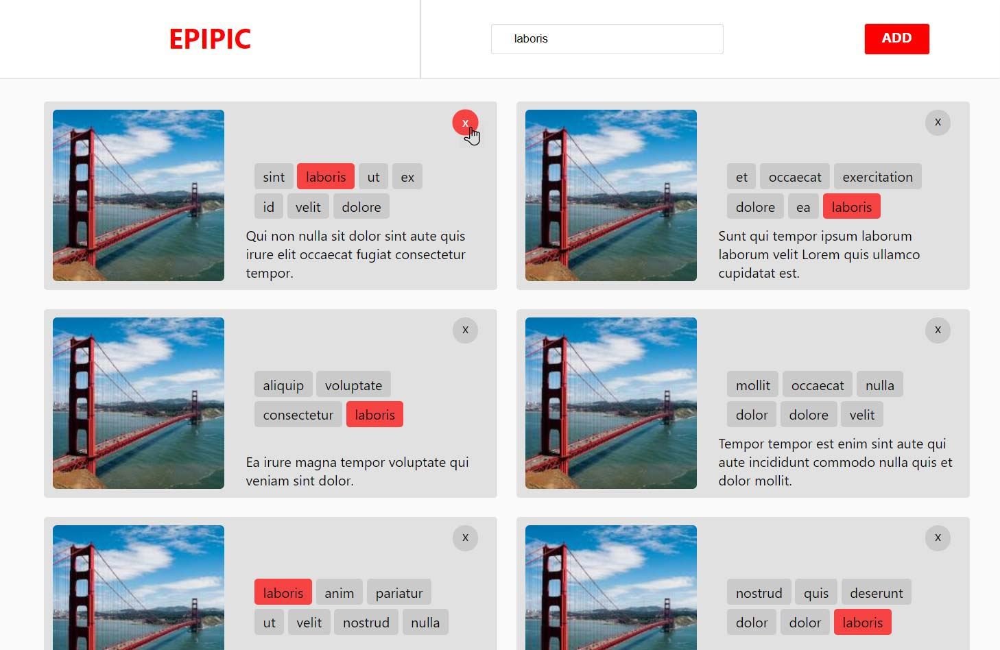

# EPIPIC
EPIPIC is a dummy Photo collection app.

Two distinct parts:
An api to manage photos (browse, add, delete).
A single page, infinite scrolling client.

Pictures are from `lorempixel`.


## Homepage


## Image popup


## Usage
```
yarn install

yarn start
```

Server will run on port `4242` by default.